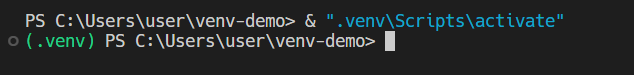
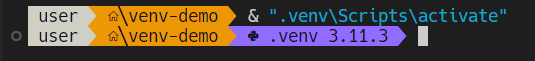

# Python Virtual Environment

# Table of Contents
- [Python Virtual Environment](#python-virtual-environment)
- [Table of Contents](#table-of-contents)
- [Introduction](#introduction)
- [Setup](#setup)
  - [The Easy Way (VSCode)](#the-easy-way-vscode)
  - [The Hard Way (Terminal)](#the-hard-way-terminal)
  - [Upgrading pip](#upgrading-pip)
  - [Prompt Prefix](#prompt-prefix)
- [Packages](#packages)
  - [Import](#import)
  - [Tracking](#tracking)
  - [Export](#export)
- [Deactivation](#deactivation)

# Introduction

[venv](https://docs.python.org/3/tutorial/venv.html) (short for "virtual environment", pronounced 'Vee-Env') is a built-in developer tool for tracking and isolating Python packages dependancies; This comes handy especially when developing a single project with multiple moving parts.

To track these dependancies, a "requirements.txt" file which lists all of them, is present at the root of each folder.  
A developer should always keep this file up-to-date since this is not automated

Each venv has its own Python interpreter, 

**Important** - never push a venv folder to a remote, as it is deployed locally by the developer (think of it as "node_modules").

# Setup

## The Easy Way (VSCode)

1. Navigate to the folder you want to work on, find the requirements file, open it.

1. A blue "Create Environment..." button will appear in the bottom-right corner: click it.

1. Hit Enter twice, all found requirements files will be listed, select the ones relevent to you.  
*Note that selecting multiple files may result in dependancy conflicts!

Now you have the ".venv" installed at the root of the project, with its bundled interpreter selected as VSCode's Python interpreter!


## The Hard Way (Terminal)

1. Create the venv by running the following command (naming the venv folder as ".venv" by default):  
    ```powershell
    py -m venv "path\to\.venv"
    ```

1. Activate the venv by running the "activate" shell script:
    ```powershell
    & "path\to\.venv\Scripts\activate"
    ```

1. Install dependancies from a requirements file:  
    ```powershell
    pip install -r "path\to\requirements.txt"
    ```

## Upgrading pip
It's a good practice to keep the venv's pip up to date:
```powershell
py -m pip install --upgrade pip
```

## Prompt Prefix
Once activated, a prompt prefix will be shown in the shell, indicating the currently activated venv.

If you use regular Terminal like a plebeian, this would look like:



If you use [oh-my-posh](https://github.com/yuval-ro/guides/blob/master/ohmyposh/ohmyposh.md) like a high-speed low-drag individual, this would look like:



# Packages 
You can now install any packages using pip like normal:
```powershell
pip install sympy -y
```
Note that the packages will be installed only on the current venv, and NOT on your default OS Python interpreter as well.

## Import
Like mentioned above, you can install dependancies from an included requirements file:  
```powershell
pip install -r "path\to\requirements.txt"
```

## Tracking
Assuming you are currently running a venv, run the following command:
```powershell
pip freeze > requirements.txt
```
This will save the current venv's packages and versions to the file.

## Export
Always include the up-to-date requirements file with the project, whether remote or local!


# Deactivation
When you are done with a venv, run the following command:
```powershell
deactivate
```
Which will quit the current venv and default back to your root's python interpreter.
